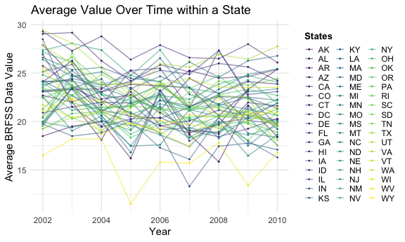
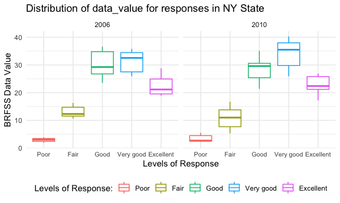

p8105\_hw3\_sl4836
================
Hun
10/16/2021

### ggplot theme template from Dr.Goldsmith github

### Problem 0

``` r
getwd()
```

    ## [1] "/Users/iseonghun/p8105_hw3_sl4836."

``` r
dir.create(file.path(getwd(), "HW3_data_file"), recursive = TRUE)

list.files()
```

    ## [1] "HW3_data_file"           "p8105_hw3_sl4836_files" 
    ## [3] "p8105_hw3_sl4836..Rproj" "p8105_hw3_sl4836.md"    
    ## [5] "p8105_hw3_sl4836.Rmd"    "README.md"

### Problem 1\_Import Data and Data\_Summary

``` r
library(p8105.datasets)
data("instacart")
```

### Problem 1\_Data\_Summary

``` r
instacart <- instacart 

instacart %>% head
```

    ## # A tibble: 6 × 15
    ##   order_id product_id add_to_cart_order reordered user_id eval_set order_number
    ##      <int>      <int>             <int>     <int>   <int> <chr>           <int>
    ## 1        1      49302                 1         1  112108 train               4
    ## 2        1      11109                 2         1  112108 train               4
    ## 3        1      10246                 3         0  112108 train               4
    ## 4        1      49683                 4         0  112108 train               4
    ## 5        1      43633                 5         1  112108 train               4
    ## 6        1      13176                 6         0  112108 train               4
    ## # … with 8 more variables: order_dow <int>, order_hour_of_day <int>,
    ## #   days_since_prior_order <int>, product_name <chr>, aisle_id <int>,
    ## #   department_id <int>, aisle <chr>, department <chr>

``` r
instacart_names <- names(instacart)
instacart_nrow <- nrow(instacart)
instacart_ncol <- ncol(instacart)
```

The size of the dataset is **1384617 x** **15** and **15** variables:
*order\_id, product\_id, add\_to\_cart\_order, reordered, user\_id,
eval\_set, order\_number, order\_dow, order\_hour\_of\_day,
days\_since\_prior\_order, product\_name, aisle\_id, department\_id,
aisle, department.* There are **1384617** number of observations without
missing data. Among these, there are 4 character variables and 11
numeric variables.

### Problem 1\_(a)\_Answering how many aisles are there, and which aisles are the most items ordered from.

``` r
Arranged_aisles <- 
  instacart %>% 
  group_by(aisle) %>% 
  summarise(n = n()) %>% 
  arrange(desc(n))

number_aisles <- 
  nrow(Arranged_aisles)

top_3_item <- 
  Arranged_aisles %>% 
  mutate(aisle = str_to_title(aisle)) %>% 
  pull(aisle) %>%
  head(3)

top_item <- 
  Arranged_aisles %>% 
  mutate(aisle = str_to_title(aisle)) %>% 
  pull(aisle) %>%
  first()
```

There are **134** aisles. Among them, top 3 aisles that have the most
ordered items are **Fresh Vegetables, Fresh Fruits, Packaged Vegetables
Fruits.** It follows that **Fresh Vegetables** has the largest number of
ordered items.

### Problem 1\_(b)\_Making a plot that shows the number of items ordered in each aisle

``` r
Arranged_aisles %>% 
  filter(n>10000) %>%
  ggplot(aes(x = reorder(aisle, n), y = n)) + 
  geom_bar(stat = "identity") + 
  coord_flip() +
  labs(y = "Number of Items", 
       x = "Aisles", 
       title = "The Number of Items Ordered in Each Aisle",
       subtitle = "From aisles that have at least more than 10,000 items") +
  theme(axis.text.y = element_text(size =7.5, face="bold"))
```


This plot shows the number of items ordered in each aisles with at least
10,000 items in a descending order. As aforementioned from the previous
part, fresh vegetables aisle has the largest number of items, followed
by fresh fruits aisle, packaged vegetables fruits aisle, yogurt aisle,
etc.

### Problem 1\_(c)\_making a table showing the three most popular items in each aisles

``` r
options(knitr.kable.NA = 0)

baking_top3 <- instacart %>% 
  filter(aisle == "baking ingredients") %>% 
  group_by(product_name) %>% 
  summarise(n = n()) %>% 
  arrange(desc(n)) %>% 
  slice(1:3) %>%
  mutate(aisle = "baking ingredients")

dog_food_top3 <- instacart %>% 
  filter(aisle == "dog food care") %>% 
  group_by(product_name) %>% 
  summarise(n = n()) %>% 
  arrange(desc(n)) %>% 
  slice(1:3) %>%
  mutate(aisle = "dog food care")

packaged_vege_fruit_top3 <- instacart %>% 
  filter(aisle == "packaged vegetables fruits") %>% 
  group_by(product_name) %>% 
  summarise(n = n()) %>% 
  arrange(desc(n)) %>% 
  slice(1:3) %>%
  mutate(aisle = "packaged vegetables fruits")

bind_rows(baking_top3 ,
          dog_food_top3, 
          packaged_vege_fruit_top3)  %>%
    mutate(aisle = str_to_title(aisle)) %>%
  rename(Aisle = aisle) %>%
  knitr::kable(align = "c", format = "pipe", 
               caption = "**Table 1: Three Most Popular Items 
               with their counts in Each Aisles**")
```

|                 product\_name                 |  n   |           Aisle            |
|:---------------------------------------------:|:----:|:--------------------------:|
|               Light Brown Sugar               | 499  |     Baking Ingredients     |
|               Pure Baking Soda                | 387  |     Baking Ingredients     |
|                  Cane Sugar                   | 336  |     Baking Ingredients     |
| Snack Sticks Chicken & Rice Recipe Dog Treats |  30  |       Dog Food Care        |
|      Organix Chicken & Brown Rice Recipe      |  28  |       Dog Food Care        |
|              Small Dog Biscuits               |  26  |       Dog Food Care        |
|             Organic Baby Spinach              | 9784 | Packaged Vegetables Fruits |
|              Organic Raspberries              | 5546 | Packaged Vegetables Fruits |
|              Organic Blueberries              | 4966 | Packaged Vegetables Fruits |

**Table 1: Three Most Popular Items with their counts in Each Aisles**

This table shows three most popular items with their counts in eash
Aisles. In Baking Ingredients aisle, **light brown sugar, pure baking
soda, and cande sugar** are top 3 popular items. In Dog Food Care aisle,
**snack sticks chicken & rice recipe dog treats, organix chicken & brown
rice recipe, and small dog biscuits** are top 3 popular items. In
Packaged Vegetables Fruits aisle, **organic baby spinach, organic
raspberries, and organic blueberries** are top 3 popular items.

### Problem 1\_(d)\_Making a table showing the mean hour of the day

``` r
instacart %>% 
  filter(product_name == "Pink Lady Apples" |product_name == "Coffee Ice Cream") %>%
  group_by(product_name, order_dow) %>% 
  summarise(mean_hour = mean(order_hour_of_day)) %>%
  rename(Product_Name = product_name) %>%
  pivot_wider(names_from = order_dow, values_from = mean_hour) %>%
  knitr::kable(align = "c", format = "pipe",
               caption = "**The Mean Hour of the Day at which
               Each Item is Ordered on Each Day**"
               )
```

|  Product\_Name   |    0     |    1     |    2     |    3     |    4     |    5     |    6     |
|:----------------:|:--------:|:--------:|:--------:|:--------:|:--------:|:--------:|:--------:|
| Coffee Ice Cream | 13.77419 | 14.31579 | 15.38095 | 15.31818 | 15.21739 | 12.26316 | 13.83333 |
| Pink Lady Apples | 13.44118 | 11.36000 | 11.70213 | 14.25000 | 11.55172 | 12.78431 | 11.93750 |

**The Mean Hour of the Day at which Each Item is Ordered on Each Day**

This tables shows the mean hour of the day at which Pink Lady Apples and
Coffee Ice Cream are ordered on each day of the week. For Coffee Ice
Cream, Day 2 has the longest mean hour whereas Day 5 has the least mean
hour. For Pink Lady Apples, Day 3 has the longest mean hour whereas Day
1 has least mean hour.

### Problem 2\_Data Import

``` r
data("brfss_smart2010") 
```

### Problem 2\_(a)\_Data\_Cleaning

``` r
brfss <- brfss_smart2010 


brfss_clean <- brfss %>% 
  janitor::clean_names() %>% 
  filter(topic == "Overall Health") %>%
  filter(response %in% c("Excellent", "Very good",
                         "Good","Fair", "Poor" )) %>%
  mutate(response = as.factor(response) %>% 
           fct_relevel("Poor", "Fair", "Good", "Very good",
                       "Excellent")) 
```

After filtering Overall Health level solely from Topic variable, I
included responses from Excellent to Poor. And then I re-leveled the
response variable from Poor to Excellent.

### Problem 2\_(b)\_Showing States observed at 7 or more observations in 2002

``` r
brfss_clean_2002 <-
  brfss_clean %>% 
  rename(States = locationabbr) %>%
  filter(year == 2002) %>% 
  group_by(States) %>% 
  summarise(n = n_distinct(locationdesc)) %>% 
  filter(n >= 7) %>%
  arrange(n)

brfss_clean_2002_States <- brfss_clean_2002 %>% pull(States)  
brfss_clean_2002 %>% knitr::kable()
```

| States |   n |
|:-------|----:|
| CT     |   7 |
| FL     |   7 |
| NC     |   7 |
| MA     |   8 |
| NJ     |   8 |
| PA     |  10 |

**CT, FL, NC, MA, NJ, PA** are the states that were observed at 7 or
more observations in 2002.

### Problem 2\_(b)\_Showing States observed at 7 or more observations in 2010

``` r
brfss_clean_2010 <-
  brfss_clean %>% 
  rename(States = locationabbr) %>%
  filter(year == 2010) %>%
  group_by(States) %>% 
  summarise(n = n_distinct(locationdesc)) %>% 
  filter(n >= 7) %>%
  arrange(n) 
  
  
brfss_clean_2010_States <- brfss_clean_2010 %>% pull(States)  
brfss_clean_2010 %>% knitr::kable()
```

| States |   n |
|:-------|----:|
| CO     |   7 |
| PA     |   7 |
| SC     |   7 |
| OH     |   8 |
| MA     |   9 |
| NY     |   9 |
| NE     |  10 |
| WA     |  10 |
| CA     |  12 |
| MD     |  12 |
| NC     |  12 |
| TX     |  16 |
| NJ     |  19 |
| FL     |  41 |

**CO, PA, SC, OH, MA, NY, NE, WA, CA, MD, NC, TX, NJ, FL** are the
states that were observed at 7 or more observations in 2010.

### Problem 2\_(c)\_Making a spaghetti plot of BRFSS data average value over time within a state

``` r
brfss_clean %>% 
  filter(response == "Excellent") %>%
  rename(States = locationabbr) %>%
  group_by(year, States) %>%
  summarise(mean_data_value = mean(data_value, na.rm=T)) %>% 
  ggplot(aes(year, mean_data_value, color=States)) + 
  geom_point(size=0.2) + 
  geom_line(aes(group=States), alpha=0.5) +
  labs(y = "Average Value", x = "Year") +
  theme(legend.position = "right", legend.title =
          element_text(colour="black", size=10, face="bold"), 
        legend.key.size = unit(0.5, 'cm')) 
```



This is a spaghetti plot that shows a line of the average BRFSS data
value over time within a state from 2002 to 2010. It appears that the
average values are relatively high in 2002 across states.

### Problem 2\_(d)\_Making the distribution of BRFSS data\_value for responses in 2006 and 2010

``` r
library(ggridges)

brfss_clean %>% 
  filter(year == 2006 | year == 2010, locationabbr == "NY") %>%
  group_by(locationdesc) %>%
  ggplot(aes(response, data_value, color = response)) +
  geom_boxplot() +
  facet_wrap(.~year) + 
  ggtitle("Distribution of data_value for responses in NY State") +
  labs(x = "Levels of Response", y = "BRFSS Data Value") +
  scale_color_discrete(name="Levels of Response:") +
  theme(axis.text.x = element_text(size=8))
```



This twp-panel plot shows the distribution of BRFSS data value for
responses from Poor to Excellent in 2006 and 2010. It appears that there
is a similar overall trend between 2006 and 2010, but the distribution
of data value is quite different within response levels between 2006 and
2010.
